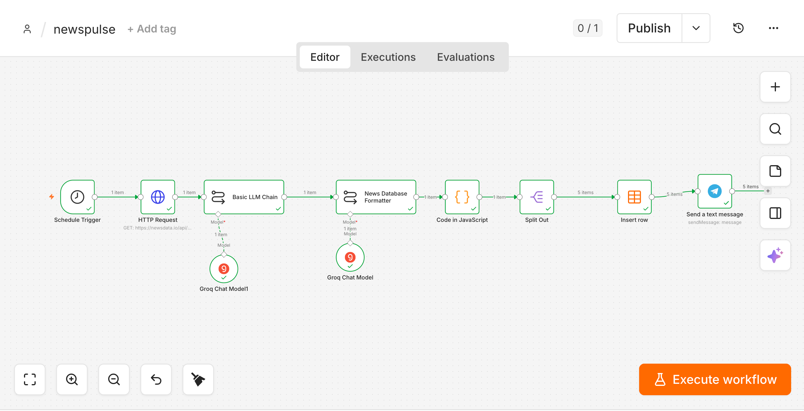
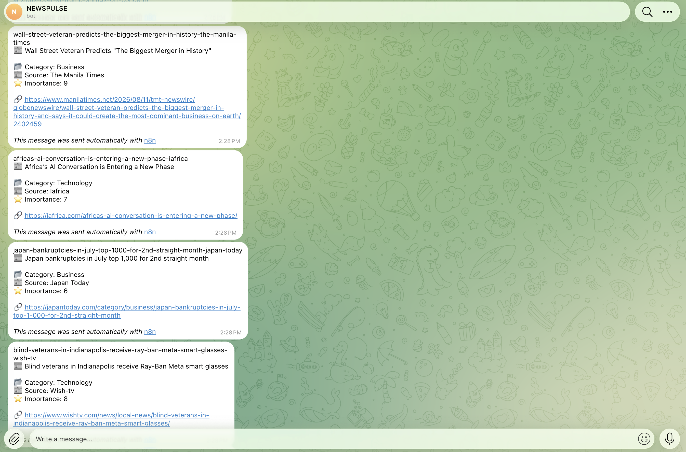
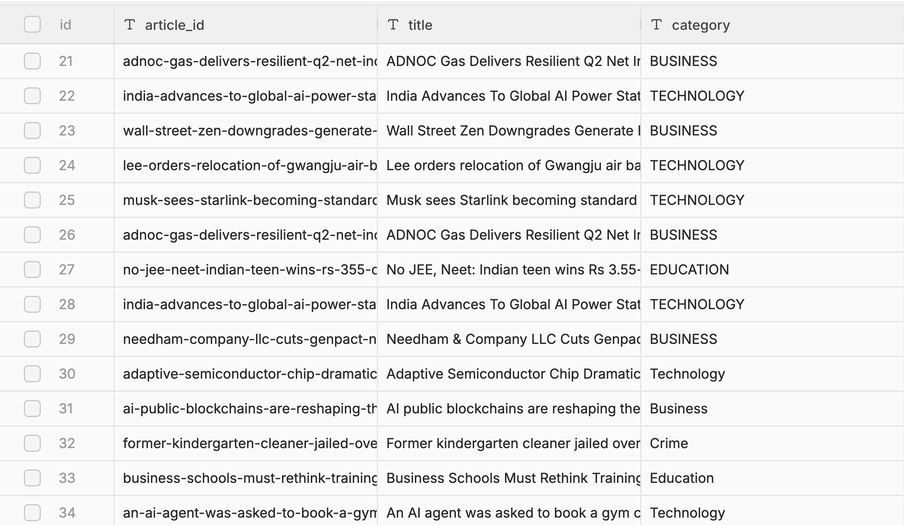

# 🤖 AI News Automation with n8n

> An automated AI-powered news intelligence pipeline that collects the latest AI news, evaluates and structures it using LLMs, stores the results in a database, and delivers formatted news updates through Telegram.

---

## 🚀 Project Overview

This project automates the complete process of discovering and delivering relevant AI news.

Instead of manually searching through dozens of articles every morning, the workflow automatically:

- Fetches the latest AI-related news
- Processes articles using an LLM
- Evaluates relevance, impact, freshness, source quality, and uniqueness
- Selects the strongest stories
- Converts the output into structured JSON
- Generates unique article IDs programmatically
- Stores selected articles in a database
- Sends formatted news to Telegram
- Runs automatically on a scheduled basis

---

## 🏗️ System Architecture

```text
Schedule Trigger
       ↓
NewsData.io API
       ↓
AI News Analysis
       ↓
News Database Formatter
       ↓
JavaScript Processing
       ↓
Split Articles
       ↓
News Database
       ↓
Telegram Delivery





